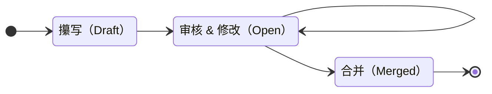

- 开始日期：2024-10-27
- RFC PR：[RuanJianZongHeng/rfcs#0001](https://github.com/RuanJianZongHeng/rfcs/pull/0001)

# 总结
此 RFC 规定了 RFC 的进程（一个 RFC 从想法到提出到最终通过被合并的完整过程），以及相关规范（如何被审核？谁来审核？仓库、PR规范是什么样的？谁来管理仓库？）。

# 动机
虽然建立了 RFC 仓库，但是还没有对详细的 RFC 进程及相关规范进行制定，所以写一个。

一群软件人在一起有软件人解决问题的方法（GitHub），一群辩论人在一起有辩论人解决问题的方法（如果你觉得你对，那么也站到台上来讲一段）。那么对于一群软件辩论人，这种 RFC 方式想必无比合适（）。

对于软件人来说，Git / GitHub 的使用是必修课，而对于辩论人来说，清晰、准确的表达，严谨、合理的逻辑，有感染力、有共鸣力的价值都是必修课。使用这种 RFC 方式来确定统一意见不仅仅具有“工具”的意义，也具有“考验”的意义，也因此也会成为相应的培训与交流的“契机”。

# 内容

### 1. 目录结构与规范

仓库的目录结构如下：

```
rfcs/
 - text/
     - xxxx-rfc-name/
         - some-pic.jpg
         - some-other-asset-file
         - ...
     - xxxx-rfcname.md
     - README.md
 - 0000-模板.md
 - README.md

```

- `text`：存放所有 RFC 文件的目录

    - ***RFC* 文件** `xxxx-rfcname`：

        以  命名，在文件中引用的附件（图片或其他文件通过相对路径引用，放在 `xxxx-rfcname/` 目录下。

    - ***索引文件*** `README.md`：

        包含对整个仓库全部 RFC 的概述，目的是呈现出目前 RFC 仓库整体的最新状态，且保留演进过程。

        每一个 ***RFC* 文件** 都应在 ***索引文件*** 中被至少引用一次。

- `0000-模板.md`：模板文件

- `README.md`：就，README

### 2. RFC 进程

RFC 的内容包括但不限于整个辩论队的：

- 共识、方针
- 组织结构
- 事务流程
- .......

这是一个 RFC 从发起到通过的状态图：



发起一个 RFC 的进程如下：


- **撰写阶段**（此阶段 PR 状态为 Draft）
  
    1. Fork 本 RFC 仓库（https://github.com/RuanJianZongHeng/rfcs）
    
    2. 复制 `0000-模板.md` 到 `text/0000-取个合适的名字.md`
    
        合适：不重复，且能够描述 RFC 内容
    
    3. 修改 `开始日期`，创建一个 commit 并提交上去（比如叫做 `Initial writeup` 或者 `added xxx` 什么的都可以）
    
    4. 发起一个 Pull Request（命名规范为 `[RFC] 合适的名称`），并且将其转换为 Draft 状态
    
        合适：能够描述 RFC 内容
    
        **这时候，可以看到这个 PR 的编号，这个编号将是你的 RFC 的编号。**
    
        在特殊的情况下，一个 RFC 可能涉及多个 PR，一般选择最早的那个 PR 的编号，注意这种情况下文件内的 `RFC PR` 需要按照顺序包含所有这些 PR，且这些 PR 中要互相提到，便于查看。
    
    5. 修改相关编号（包含文件名，最好用 `git mv` 修改，以及文件内的 `RFC PR`），再次创建并提交一个 commit（比如叫做 `Update PR numbers`）。
    
    6. 完善你的 RFC，当你觉得完成撰写阶段的时候，将其从 Draft 状态转换为 Open。
    
- **审核 & 修改阶段**（此阶段 PR 状态为 Open）

    在将 PR 从 Draft 切换为 Open 状态后，仓库的维护者会开始着手推进对 PR 的审查与修改

    这里的审查包括：

    - 仓库维护者进行的：错字、格式等的审查

        会直接在 PR 上通过 Review 给出修改意见

    - 需要 ***RFC 会议*** 的：内容的审查

        会通过会议的方式进行讨论，然后将意见整理后在 PR 上同样通过 Review 给出

    以此，RFC 会被不断改进直至通过审查。

- **合并阶段**（此阶段后 PR 状态将变为 Merged）

    仓库维护者会将 PR 并入主分支，并且更新 ***索引文件*** 引入该 RFC 的变更。

### 3. 维护者

目前，仓库的拥有者是 [RuanJianZongHeng](https://github.com/RuanJianZongHeng) 这个 GitHub 组织，而这个组织的拥有者是 [AzurIce (AzurIce)](https://github.com/AzurIce)。

如果没有意外，[AzurIce (AzurIce)](https://github.com/AzurIce) 将至少在他仍在校园的时间内一直维护该仓库。

维护者的职责是处理所有 PR 以及仓库内相关事务，并在需要进行 ***RFC 会议*** 时组织会议。

### 4. RFC 会议

***RFC 会议*** 是用于讨论审查 RFC 的会议，每一个 RFC 的通过必须经过一次 ***RFC 会议*** 的讨论。

参会人员由 *大二*、*大三*、*大四* 三个年级的成员组成，*大一*  可以进行旁听。

会议流程如下：

- 由 RFC 发起者根据 RFC 文件阐述自己的想法
- 在场的任何人都可以发表看法意见
- 参会人员表决是否通过（同意人数超过参会人数 2/3 向上取整方可通过）

维护者的职责是，维护者或任何人都没有权利直接通过某个 RFC，每一个 RFC 的通过必须以一次超过 2/3（向上取整）人通过的会议（线上/线下）为前提。

#### 设计原因

之所以限定参会人员为 *大二*、*大三*、*大四*：

- 不包含 *大一* 辩手的原因是

    他们对辩论队的认识尚不完整，需要一年的时间去将自己融入辩论队（了解队友、了解队伍、了解历史、了解现状），且他们的经验、技能尚为匮乏，需要一年的时间去经历、思考、沉淀。

- 不包含 *本科毕业* 辩手的原因是

    从辩论队的活跃群体来看，*本科* 辩手是主要部分，乃至几乎占据九成往上。

    从辩论队的发展来看，不论是纳新、培训还是参赛、面试，全程亲历参与且对具体情况了如指掌的永远都是真正身处其中的辩手。

    当然，假使有一天辩论队欣欣向荣，所有辩手全部拧在一起活跃着，乃至 *研究生* 老学长都了解大一大二的每一个辩手，了解他们每天所经历的一个个故事，那么有什么理由不包含他们呢？

    但是，现状（2023 级大一的时间）就是，活跃的辩手按照年级占比大致为：大一（90%），大二（80%），大三（40%），大四（10%）。这种情况在疫情刚结束（2022 级大一的时间）更为严重：大一（90%），大二（60%），大三（20%）。

    **未来会更好。**

之所以“发表意见”的人可以是在场的任何人的原因是，*大一* 辩手的想法不会被否定，*本科毕业* 老学长的积淀同样不会被忽视，任何辩论人都永远拥有去「表达」、「传递」、「建构」、「说服」的权利。就是那句很简单的话：

「如果你觉得你是对的，那也欢迎你上来讲一段」

之所以通过票数不是过半而是过 2/3，是因为每个 RFC 的通过与否对于整个辩论队来说是很重要的决议。而从数学的角度来看，也能够确保人数更少（至少现在是）的“老登”的意见也成为关键的一票。

这只是一个初步的设计，后续随着遇到更多的问题，可能还会有新的 RFC 产生，来细化、改进这些规则。

# 实现方式

- @AzurIce 在建立 RFC 仓库的基础架构的过程中会按照规范建立一些可用于参考的 RFC，commit、RFC 内容、PR、流程等在 GitHub 下都是保持历史可见的，可以作为新的参与者的参考。
- 需要一次会议，这次会议同时是对整个系统的说明，同时也是该 RFC 的通过会议 —— 第一个 RFC 会议。

# 问题

有关维护者更迭、RFC 会议详细规则等内容或许会需要后续的 RFC 来进行细化、改进。

有关索引文件，目的是让新来的接触者可以从一个地方看到目前整个系统的样子、看到到当前为止整个辩论队已经达成的共识与积累，应该循序渐进地将一切展开解释给读者，其内容与结构仍需后续细化。

**总之，这是个开始。**